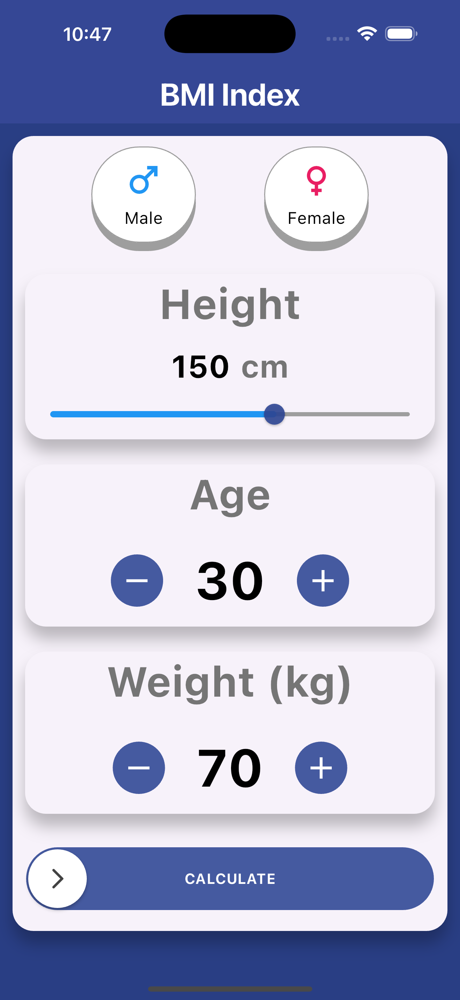
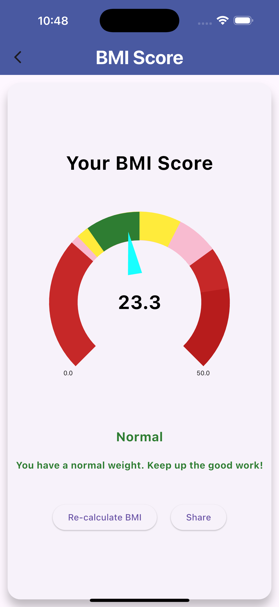

# 🧮 BMI Calculator App

A simple and beautiful Flutter app to calculate Body Mass Index (BMI). This app helps users understand their body weight status based on their height and weight.

## 📱 Features

- Input height and weight
- Calculates BMI instantly
- Displays BMI category:
  - Underweight
  - Normal
  - Overweight
  - Obese
- Clean and responsive UI
- Works on both Android and iOS

## 🚀 Getting Started

### Requirements

- Flutter SDK
- Android Studio, VS Code, or any preferred IDE
- A working Android/iOS emulator or physical device

### Installation

1. Clone this repository  
   `https://github.com/Pragyanadhikari/BMI-APP.git`
   
3. Navigate to the project directory  
   `cd bmi_index`

4. Get the dependencies  
   `flutter pub get`

5. Run the app  
   `flutter run`

## 🧮 BMI Reference

| BMI           | Category       |
|---------------|----------------|
| < 18.5        | Underweight    |
| 18.5 – 24.9   | Normal weight  |
| 25.0 – 29.9   | Overweight     |
| ≥ 30.0        | Obese          |

## 📸 Screenshots

  
  &nbsp;&nbsp;&nbsp;&nbsp;&nbsp;
  
  &nbsp;&nbsp;&nbsp;&nbsp;&nbsp;
  

## 🛠️ Technologies Used

- Flutter
- Dart

---

Made with ❤️ using Flutter
